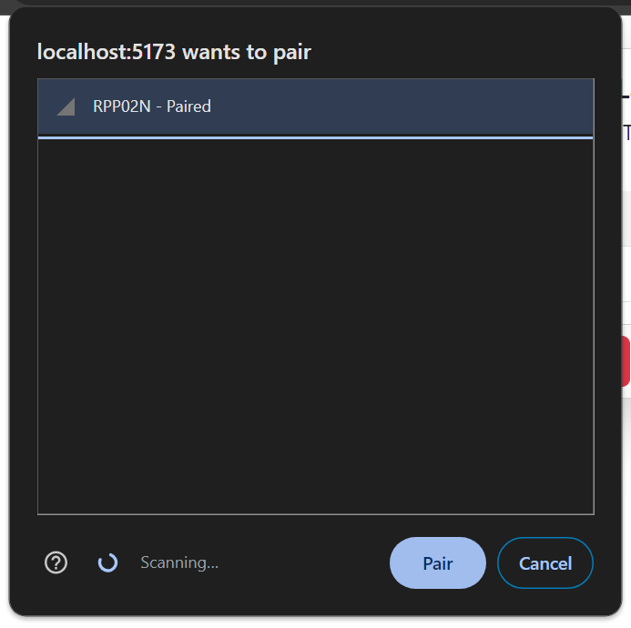
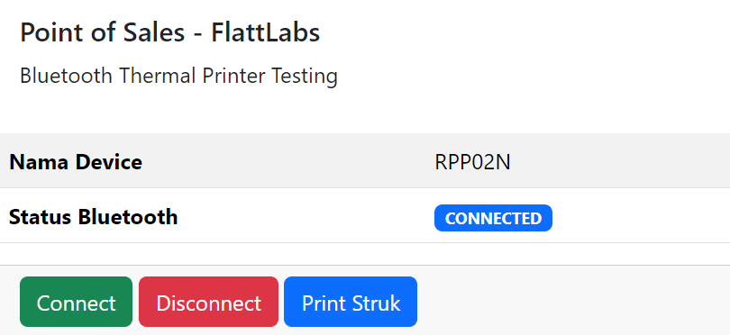
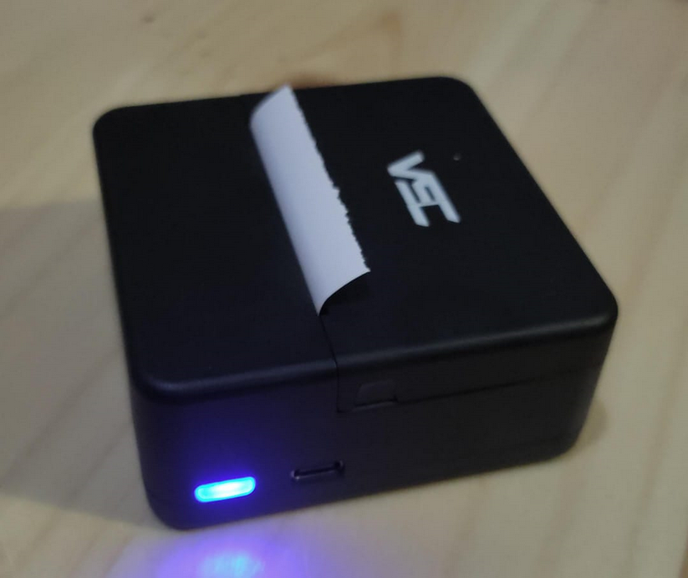
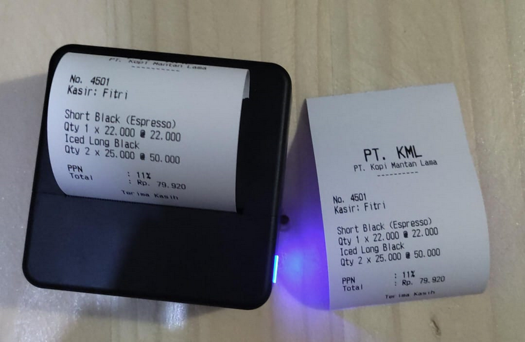

# JavaScript Bluetooth Thermal Printer

Source code ini berisi sebuah program untuk melakukan pengujian print struk menggunakan
printer Thermal melalui Bluetooth menggunakan `navigator` dari JavaScript.

Printer thermal pada pengujian ini menggunakan merk **VSC MP 58A** dengan kertas thermal
berukuran 57x30mm atau 58x30mm.

## Cara Instal

Clone project lalu masuk ke direktori dan kemudian instal dependensi yang diperlukan:

```
npm install
```

## Menjalankan Aplikasi

Jalankan perintah berikut:

```
npm run dev
```

Kemudian akses `https://localhost:5173/` di browser:


Nyalakan printer dan pastikan kertas sudah tersedia.

Klik tombol Connect, pilih printer yang tersedia. Dalam hal ini, pilih `RPP02N` lalu klik pair:



Jika koneksi berhasil, status akan menampilkan tulisan `CONNECTED`:



Warna lampu indikator berubah menjadi biru:



Klik tombol `Print Struk` untuk melihat hasilnya:


